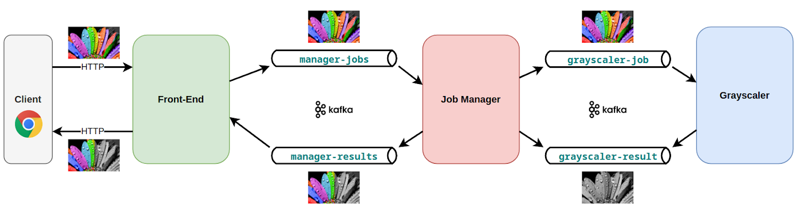

# Asynchronous Microservices Demo Application

The app converts uploaded image into half-grayscale variant.

The demo application consists from 3 microservices:

* _Front-End_ - serves single web page to accept file upload and display result, interacting with "job manager" via
  Kafka topics
* _Job Manager_ - forwards image to "grayscaler" for processing, assembles resulting image from two variants
* _Grayscaler_ - get image via Kafka and sends back grayscale variant of it



## Running Application Normally

On the top root directory of repository, just run it with docker-compose:

```shell
docker-compose up
```

The app will start up. You will see some warnings about topics not existing, this is normal because our Kafka is empty.

Now open in your browser [http://localhost/](http://localhost/) to see the application. Then upload a colorful image via web form and wait for resulting image to appear. 

Upload more images to get more results. Notice that after the first result the Kafka topics have been created and there are no more log warnings. In the log, you can see messages about different services working with Kafka topics.

To stop the application, press `Ctrl+C`

## Running Front-End Isolated

## Running Job Manager Isolated

## Running Grayscaler Isolated
